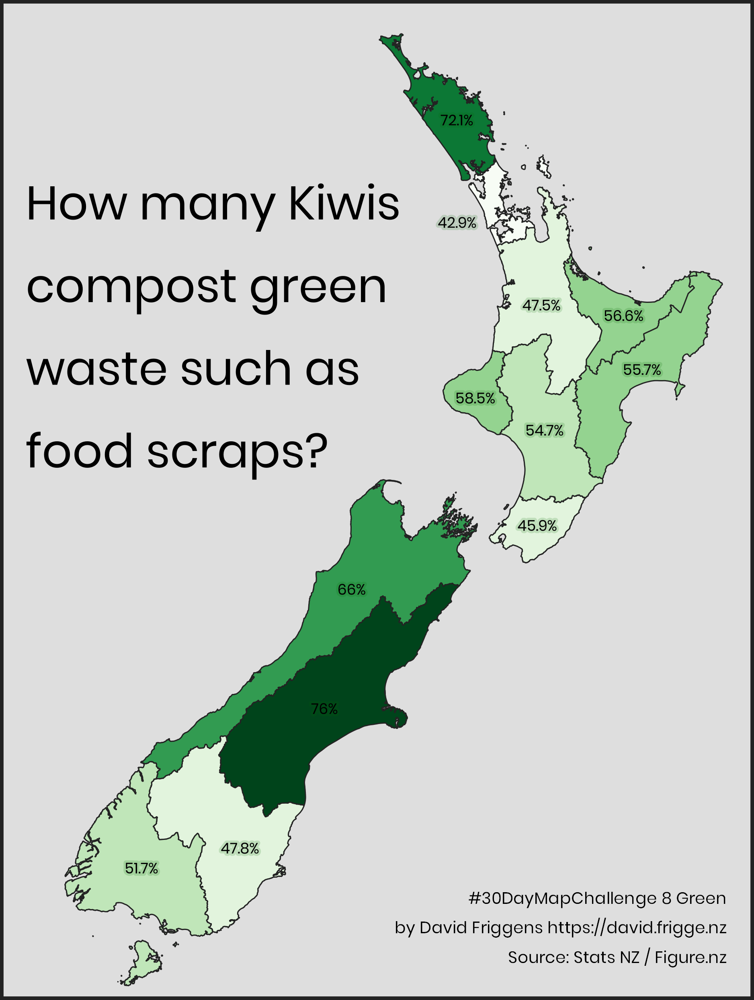
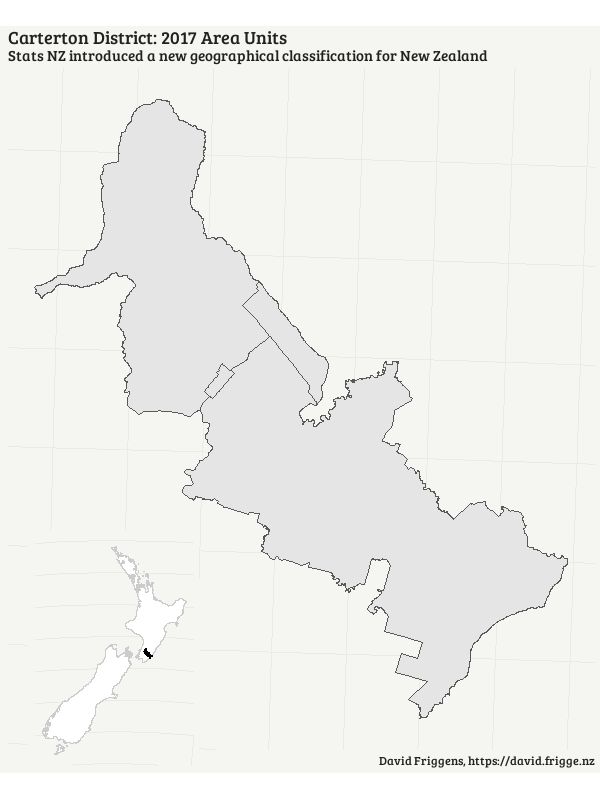
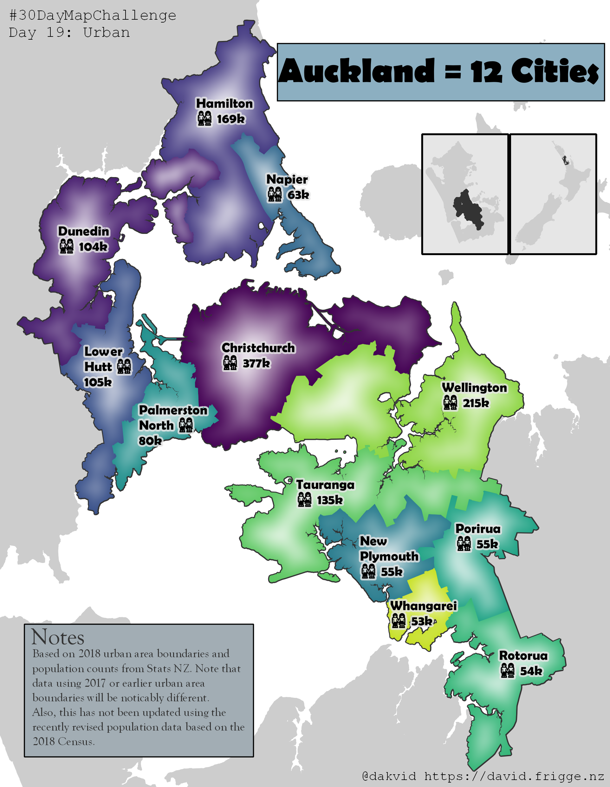

My attempts at #30DayMapChallenge, issued by
[Topi Tjukanov](https://twitter.com/tjukanov/status/1187713840550744066).

To see what other people are doing, check out the amazing curation by
[Aurelien Chaumet](https://public.tableau.com/profile/aurelien.chaumet#!/vizhome/30daymapchallenge/30DayMapChallenge-Week1?publish=yes).

I started halfway through, with the intention of where time and energy
allowed.

## 8. Green

Proportion of New Zealanders who compost green waste, by region.
Initially intended for Day 21, Environment.

Data prepared in R ([code](docs/08_green_data.R)) and map created with QGIS.

## 14. Boundaries

Animation of Carterton District small area boundaries:
2017 Area Unit vs 2018 Statistical Area 2, as Stats NZ
has introduced a new geographical classification for
New Zealand.

[[R code](docs/14_boundaries_carterton.R)]
(I haven't copied the data files here, as they're large, but
they were all downloaded from [Stats NZ](stats.govt.nz))

## 17. Zones

New Zealand's Exclusive Economic Zone. My first QGIS map,
and a bit of a failure. I got 25% of what I wanted in QGIS,
another 25% in Inkscape, and the remainder traded for sleep.
But I learned things, which is the whole point of this
exercise.

## 18. Globe

Showing the distance between Antarctic territories and
their controlling countries. Not mentioning Norway's
Peter I Island nor the conflict between Chile, Argentina
and the UK.

[[R code](docs/18_globe_antarctica.R)]
Quickly done in R with the threejs package after getting
90% there in QGIS and losing it all (unsaved!) in a crash.

Here are some screenshots, but see the
[proper page](https://david.frigge.nz/map30days/) for the
interactive version.

## 19. Urban

Auckland urban area has the same population as the next 12 biggest New Zealand
cities. (Or at least it did before recently revised official figures.)
A few months ago I made this [map for work](http://www.infometrics.co.nz/chart-month-auckland-big/)
with R, here I've remade it with QGIS.
([PDF version too](docs/19_urban_auckland.pdf))

## 20. Rural

Why not map ... no rural areas? I imagined New Zealand's urban areas as
an archipelago. Starting to feel more familiar with QGIS.
([PDF version too])docs/20_rural_archipelago.pdf))

